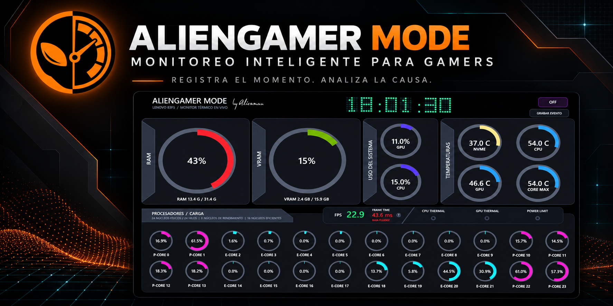
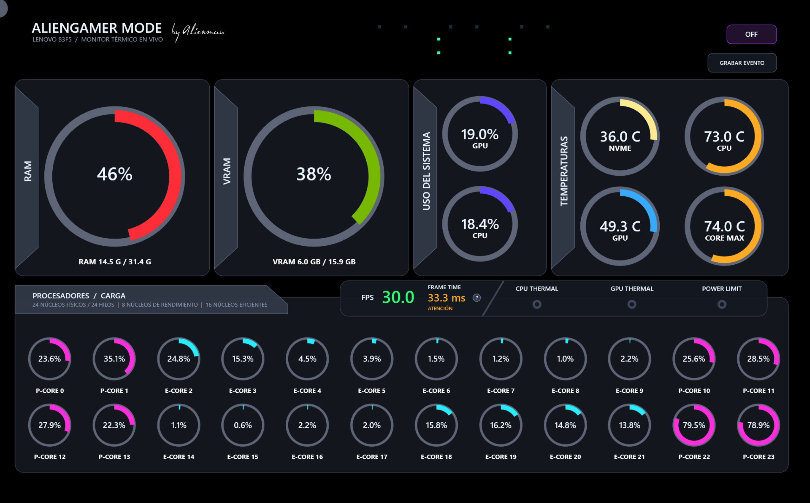
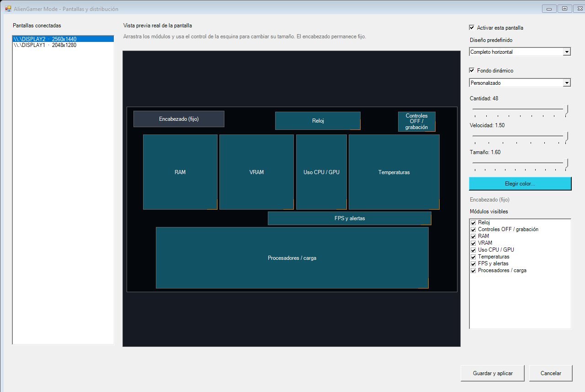
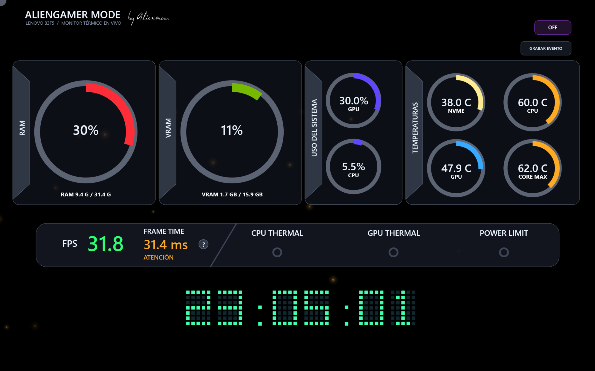

# AlienGamer Mode

[Español](README.md) · **English**

**Adaptive Windows hardware and sensor monitoring for gamers.**



[](https://github.com/alienmau/AlienGamer-Mode/releases/latest)
[](https://github.com/alienmau/AlienGamer-Mode/releases)
[](LICENSE)
[](#requirements)

**[Download the latest release](https://github.com/alienmau/AlienGamer-Mode/releases/latest)** · **[Report an issue](https://github.com/alienmau/AlienGamer-Mode/issues/new/choose)**

AlienGamer Mode is a Rainmeter and HWiNFO dashboard that detects the available hardware, adapts its layout to the selected display and avoids presenting missing sensors as real zero values.

Version 1.5.9 keeps the visual multi-display editor introduced in 1.5.8 and fixes a visual regression that could draw duplicate gray rings over RAM, system usage, and temperature gauges. It also keeps the stray upper-left corner semicircle removed. Layout-only changes reuse the already validated sensor profile, apply in a few seconds, and display an on-screen progress notice while finishing.

## Highlights

- RAM, VRAM, CPU/GPU usage and temperatures.
- Dynamic per-core load with automatic removal and reordering of unavailable sensors.
- FPS and frame time with clear visual classifications.
- Thermal and power-limit indicators when HWiNFO provides them.
- Matrix-style clock, custom or thermal-dynamic ambient fireflies, and dark glass panels.
- OLED protection through subtle periodic pixel shifting.
- Manual event recording with a technical Excel report.
- Persistent per-display visibility, position and size for optional modules.
- Display, GPU and primary-drive selection during installation.
- Spanish and English UI, selectable during installation or from the tray icon.
- Multiple simultaneous local-display views with independent persistent layouts.
- Drag-and-resize editing for RAM, VRAM, usage, temperatures, FPS, processors, clock and controls; the header remains fixed and mandatory.



## Requirements

- 64-bit Windows 10 or Windows 11.
- 4 GB RAM minimum; 8 GB recommended, or 16 GB when gaming on the same PC.
- Dual-core x64 processor or better.
- Approximately 100 MB free storage, excluding saved reports.
- [Rainmeter 4.5 or later](https://www.rainmeter.net/).
- [HWiNFO 7.34 or later](https://www.hwinfo.com/download/) with sensors and Shared Memory Support enabled.
- Microsoft Excel is optional and only needed to open `.xlsx` reports directly.

Rainmeter and HWiNFO are third-party products and are not bundled with this repository.

### Approximate resource usage

On the development system, with 24 logical processors, all sensors, 48 fireflies and 10 FPS visual animation, the complete stack averaged approximately **457 MB RAM** and **5.4% total CPU**. Actual usage varies by hardware, sensor count, other Rainmeter skins and visual settings.

## Installation

1. Install Rainmeter and HWiNFO from their official sites.
2. Enable sensors and **Shared Memory Support** in HWiNFO.
3. Download and run `AlienGamerMode-Setup-1.5.9.exe` as administrator.
4. Choose **English** or **Español**, then select the target display, GPU and primary drive.
5. Finish installation; the dashboard starts automatically and remains available from the tray icon.

## Displays and layout

Open the tray menu and choose **Displays and layout...**. The editor represents each connected screen at its real aspect ratio and can enable several displays, drag and resize each optional module, hide blocks, apply horizontal or vertical presets, and select a separate background mode for every view. Manual backgrounds expose particle count, speed, size and color controls; thermal mode manages those values automatically.

Presets update the preview immediately, while the live dashboard changes only after **Save and apply**. Modules remain inside screen bounds, keep a minimum separation and cannot overlap. The mandatory header cannot be dragged and stays at the upper-left safety margin, except in **Essential portrait**, where it is centered at the top. Saving rebuilds only the Rainmeter views; HWiNFO, the local bridge and event recording remain shared.

Layouts are stored under `displayViews` in `%LOCALAPPDATA%\AlienGamerMode\AlienGamerMode.json` and survive restarts. The editor opens automatically after every setup run with every module visible. While the 1.5 branch is being stabilized, each installation resets visual settings and backs up the previous JSON, while recordings and reports remain untouched. Phones and tablets are not remote companions yet; that network-facing capability is intentionally reserved for a later release with explicit privacy and access controls.

### Multiple displays and visual layout

One AlienGamer Mode installation can activate a different view on every connected display:

- Each display can be enabled or disabled without stopping the others.
- Clock, controls, RAM, VRAM, CPU/GPU usage, temperatures, FPS/alerts, and processor modules are selected independently per display.
- Visible modules can be dragged and resized inside a preview that preserves the real display resolution and aspect ratio.
- The editor prevents overlaps, unsafe spacing, and out-of-bounds placement. The identifying header remains fixed and visible.
- Full horizontal, essential horizontal, essential vertical, performance-only, and temperatures-only presets can be previewed before applying.
- Each display has its own disabled, custom, or thermal dynamic background.
- Layout choices persist across restarts.
- Visual-only changes reuse the validated sensor profile, show an `Applying changes…` notice on affected displays, and avoid restarting HWiNFO or the data bridge.

To keep the tray menu concise, the former global **Background** and **Visible modules** menus now live under **Displays and layout...**, where they can be configured correctly for each display. The main menu keeps global actions such as starting/stopping the monitor, recording or marking incidents, language selection, hardware/display selection, logs, and closing the app.





### Next release: local mobile dashboard

The next planned improvement will let a phone or tablet work as an additional real-time display:

- AlienGamer Mode will expose a lightweight web microservice only on the local network.
- A temporary QR code will open the dashboard directly on the portable device.
- Users will be able to select and arrange modules independently for each phone or tablet.
- Sensor data will remain local and will not require a cloud service.
- Temporary sessions, device revocation, and adjustable refresh limits will protect privacy, battery life, CPU, and network usage.
- The service will be disabled by default and will clearly show which local address is exposed.

This feature is still in design and is not included in version 1.5.9.

## Changing the language

Right-click the AlienGamer Mode tray icon and choose **Language → English** or **Idioma → Español**. The selection is saved and the active Rainmeter skin is regenerated and refreshed without restarting HWiNFO or the sensor bridge. If the monitor is stopped, the new language is applied the next time it starts.

## Thermal dynamic background

Open **Displays and layout...** to choose **Off**, **Custom**, or **Thermal dynamic** independently for every monitor. Custom mode keeps that display's selected color and particle settings. Thermal mode compares valid CPU, maximum-core and GPU temperatures against component-specific thresholds; the most demanding valid state controls the firefly color. A reported thermal-throttling flag forces the critical red state. The former global **Background** tray menu was removed so one action cannot overwrite every display.

Firefly density blends recent frame-time fluidity/stability with CPU/GPU activity. When GPU saturation or degraded frame time is detected, thermal mode gradually reduces particles and movement to yield resources to the game. Custom firefly controls are available only in **Custom** mode; **Thermal dynamic** uses separate conservative automatic parameters. Missing sensors are ignored rather than interpreted as real zero values.

Use **Configure hardware and display...** from the tray to change the target display, GPU or primary storage without reinstalling. Displays are saved by physical identity, so the selection survives Windows renaming `DISPLAY1` to another number.

## Recording a performance event

While the monitor is active it keeps a local rolling buffer covering the previous 60 seconds. When you notice stutter, freezes or another suspicious behavior, press **Record event**. Choose **Mark incident now** in the tray menu whenever the symptom appears; right-clicking the skin's record button also creates a marker.

Finishing a recording creates three companion files: a responsive standalone HTML report, an Excel workbook and the raw CSV. The visual report opens in any modern browser without an Internet connection and includes an executive summary, a 0–100 stability score, separate correctly scaled FPS and frame-time charts, temperatures, utilization and marked incidents. The workbook retains raw samples, incident windows, comparison with the previous local session and a privacy sheet. The CSV remains available for independent or AI-assisted analysis.

Excel is optional. If it is not installed or workbook creation fails, AlienGamer Mode still preserves the visual report and raw CSV whenever possible.

The resulting report can help correlate the symptom with overheating, resource saturation, throttling or frame-time instability. Its interpretation is preliminary: it does not prove a root cause or replace game logs, detailed SMART diagnostics, network analysis or specialized traces.

## Performance view

In **Displays and layout...**, choose the **Performance only** preset to center the FPS, frame-time and alert panel. Before saving, it can be moved, resized or combined with other modules. The setting persists without disabling sensor capture.

## Privacy

AlienGamer Mode runs locally and sends no telemetry. Reports are created only when the user starts an event recording and may contain process names and hardware details; review them before sharing.

## Build and test

Install Inno Setup 6, then run:

```powershell
powershell.exe -NoProfile -ExecutionPolicy Bypass -File .\tests\Test-AlienGamerMode.ps1
powershell.exe -NoProfile -ExecutionPolicy Bypass -File .\installer\Build-Installer.ps1
```

The installer is generated in `build/installer/`.

## License

Original project code is released under the [MIT License](LICENSE). Third-party names and components retain their respective licenses.

Created by **Alienmau**.
