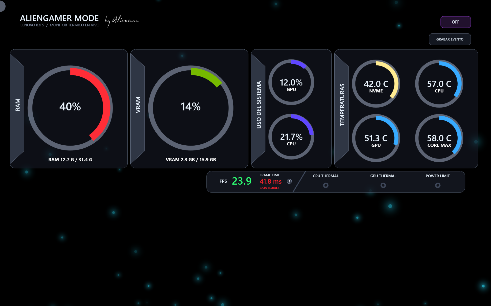

# AlienGamer Mode

**Español** · [English](README.en.md)

**Monitoreo adaptable de sensores y componentes del equipo para Windows.**


[](https://github.com/alienmau/AlienGamer-Mode/releases/latest)
[](https://github.com/alienmau/AlienGamer-Mode/releases)
[](LICENSE)
[](#requisitos)

**[Descargar la última versión](https://github.com/alienmau/AlienGamer-Mode/releases/latest)** · **[Guía de instalación](docs/GUIA-INSTALACION-MANUAL.md)** · **[Reportar un problema](https://github.com/alienmau/AlienGamer-Mode/issues/new/choose)**

AlienGamer Mode es un panel gamer creado con Rainmeter y HWiNFO. Detecta el hardware disponible, adapta el diseño a la pantalla seleccionada y muestra métricas útiles sin inventar valores cuando un sensor no existe.

La versión 1.5.2 añade un editor visual multidisplay: cada pantalla puede tener módulos, posiciones, diseño y fondo propios. Comparte una sola lectura validada de HWiNFO, por lo que no duplica el puente de sensores ni la grabación de eventos. Esta revisión hace visible el editor sin mostrar una consola, recupera automáticamente el menú si la ventana no llega a abrir y guía la configuración inicial al instalar o migrar.

## ¿Por qué AlienGamer Mode?

Un contador de FPS dice que algo ocurrió; AlienGamer Mode ayuda a conservar el contexto técnico del momento. Si notas un tirón, congelamiento, teletransporte o caída de fluidez, puedes iniciar una grabación y obtener un reporte que relacione el comportamiento del juego con temperaturas, carga, memoria, tiempo de cuadro y alertas disponibles.

- **Adaptable:** detecta el hardware real y reorganiza los módulos disponibles.
- **Honesto con los datos:** un sensor ausente se oculta o muestra `N/D`; nunca se inventa como cero.
- **Útil para investigar:** registra el intervalo exacto donde percibiste el problema.
- **Local y abierto:** no envía telemetría y su código puede auditarse.
- **Pensado para OLED:** realiza pequeños desplazamientos para reducir elementos estáticos prolongados.


## Funciones principales

- RAM, VRAM, carga de CPU y GPU.
- Temperaturas de CPU, núcleo máximo, GPU y almacenamiento principal.
- Carga dinámica por núcleo; los núcleos inexistentes se ocultan y los restantes se reorganizan.
- FPS y *frame time* con clasificación visual de fluidez.
- Indicadores de límite térmico y de potencia cuando HWiNFO los proporciona.
- Reloj digital tipo matriz.
- Fondo ambiental opcional con partículas luminosas tipo luciérnaga.
- Glassmorfismo oscuro que permite percibir el fondo sin perder legibilidad.
- Animación suavizada de anillos y destello en rangos críticos.
- Protección para pantallas OLED mediante pequeños desplazamientos periódicos.
- Grabación manual de eventos y exportación de registros para diagnóstico.
- Agente de bandeja para activar, detener, grabar y cerrar el monitor.
- Módulos opcionales persistentes para mostrar u ocultar **Procesadores / carga**, **FPS, frame time y alertas**, y el **Reloj**.
- Selección de monitor, GPU y unidad principal durante la instalación.
- Interfaz en español e inglés, seleccionable durante la instalación o desde el icono de bandeja sin reiniciar los sensores.
- Varias vistas simultáneas en monitores locales, con distribución independiente y persistente.
- Editor visual para arrastrar RAM, VRAM, uso, temperaturas, FPS, procesadores, reloj, encabezado y controles.

## Requisitos

- Windows 10 u 11 de 64 bits.
- 4 GB de RAM como mínimo para ejecutar el monitor; 8 GB recomendados y 16 GB recomendados si se jugará en el mismo equipo.
- Procesador x64 de dos núcleos como mínimo.
- 100 MB de espacio libre para AlienGamer Mode y sus dependencias, sin contar reportes guardados.
- [Rainmeter 4.5 o posterior](https://www.rainmeter.net/).
- [HWiNFO 7.34 o posterior](https://www.hwinfo.com/download/), con sensores y memoria compartida habilitados.
- Microsoft Excel es opcional; solo se necesita para abrir directamente los reportes `.xlsx`.

Rainmeter y HWiNFO son productos externos y no se distribuyen dentro de este repositorio.

### Consumo orientativo

Medición realizada durante 15 segundos en el equipo de desarrollo, con 24 procesadores lógicos, 48 luciérnagas, animación a 10 FPS y todos los sensores activos:

| Componente | RAM promedio | CPU promedio del equipo |
| --- | ---: | ---: |
| Agente de AlienGamer Mode | 122 MB | 0.16% |
| Puente de sensores | 221 MB | 0.43% |
| Rainmeter | 82 MB | 4.54% |
| HWiNFO | 31 MB | 0.28% |
| **Conjunto completo** | **aprox. 457 MB** | **aprox. 5.4%** |

Son valores orientativos, no requisitos garantizados. El consumo cambia según procesador, cantidad de sensores/núcleos, número y tamaño de partículas, otras skins cargadas en Rainmeter y versión de HWiNFO. Reducir las luciérnagas o desactivar el fondo disminuye la carga visual.

## Compatibilidad

El instalador permite elegir pantalla, GPU y almacenamiento principal. La skin se construye según la resolución, escala DPI y sensores detectados. El proyecto nació en un Lenovo Legion, pero no está limitado a esa marca.

La validación comunitaria en combinaciones NVIDIA, AMD e Intel continúa. Si lo pruebas en otro equipo, abre un **Reporte de compatibilidad** desde [Issues](https://github.com/alienmau/AlienGamer-Mode/issues/new/choose); incluso un resultado correcto ayuda a documentar hardware confirmado.

## Instalación

1. Instala y configura los requisitos indicados arriba.
2. Descarga el instalador más reciente desde [Releases](https://github.com/alienmau/AlienGamer-Mode/releases/latest).
3. Ejecuta `AlienGamerMode-Setup-1.5.2.exe` y elige **Español** o **English**.
4. Selecciona la pantalla, GPU y unidad de almacenamiento que deseas supervisar.
5. Finaliza la instalación; el panel se activa automáticamente y queda disponible desde el icono de la bandeja.

Consulta [Requisitos previos](docs/REQUISITOS-PREVIOS.md) y la [Guía de instalación manual](docs/GUIA-INSTALACION-MANUAL.md) si necesitas configurar HWiNFO o resolver un problema.

## Pantallas y distribución

Abre el menú del icono de bandeja y selecciona **Pantallas y distribución...**. El editor muestra cada monitor conectado y permite:

- activar una o varias pantallas al mismo tiempo;
- arrastrar cada bloque a una posición independiente;
- mostrar u ocultar cualquier módulo sin detener los sensores;
- aplicar diseños completos, esenciales, verticales, sólo rendimiento o sólo temperaturas;
- activar o desactivar el fondo por pantalla y elegir fondo personalizado o térmico.

Pulsa **Guardar y aplicar** para reconstruir únicamente las vistas de Rainmeter. HWiNFO, el puente local y la grabación permanecen compartidos. La selección se conserva en `displayViews` dentro de `%LOCALAPPDATA%\AlienGamerMode\AlienGamerMode.json` y vuelve a aplicarse al iniciar Windows.

La primera vista mantiene la selección hecha en el instalador. El editor se abre automáticamente al terminar cualquier instalación para elegir módulos y distribución; posteriormente puede abrirse siempre desde el icono de bandeja. En una actualización se cargan y conservan las configuraciones creadas previamente por 1.5. Teléfonos y tabletas aún no funcionan como pantallas remotas; esa extensión está prevista para una versión posterior y requerirá controles explícitos de red y privacidad.

## Fondo ambiental configurable

El fondo utiliza pequeñas partículas con degradado radial: el centro conserva el color elegido y el halo se desvanece hasta ser totalmente transparente. Las luciérnagas ascienden con trayectorias, tamaños, profundidades y velocidades diferentes; su brillo pulsa con transiciones suaves. El 70% puede recorrer hasta el 75% de la altura de la pantalla y se desvanece en ese trayecto, mientras el 30% completa el 100% y rebasa ligeramente el borde superior. No utiliza, captura ni analiza audio.

Desde el icono de AlienGamer Mode, el submenú **Fondo** ofrece **Desactivado**, **Personalizado** y **Dinámico térmico**. En modo personalizado se utiliza el color elegido por el usuario. En modo térmico, CPU, núcleo máximo y GPU se comparan con sus propios umbrales y prevalece el estado válido más exigente: azul para temperatura saludable, naranja para elevada y rojo para alta o con alerta térmica.

La densidad térmica combina 70% de fluidez/estabilidad reciente de *frame time* y 30% de actividad CPU/GPU. La velocidad responde a la mayor carga válida entre CPU y GPU. Si la GPU se acerca a saturación o el *frame time* se degrada, el fondo cede recursos reduciendo progresivamente partículas y movimiento. Los cambios utilizan interpolación para evitar saltos. Si FPS o un sensor térmico no están disponibles, el sistema ignora esa lectura y utiliza solamente datos válidos; no convierte `N/D` en cero real.

**Configurar luciérnagas...** está disponible únicamente en modo **Personalizado** y permite elegir entre 8 y 48 partículas, ajustar velocidad y tamaño, y seleccionar cualquier color. **Dinámico térmico** usa parámetros automáticos independientes y conservadores; sus controles manuales se deshabilitan para evitar configuraciones contradictorias. Todos los valores se conservan en `%LOCALAPPDATA%\AlienGamerMode\AlienGamerMode.json`.

Desde el icono de bandeja, **Configurar equipo y pantalla...** permite volver a elegir monitor, GPU y almacenamiento principal sin reinstalar. La pantalla se conserva mediante su identidad física, por lo que sigue siendo reconocible aunque Windows cambie su nombre interno de `DISPLAY1` a otro número.

El submenú **Módulos visibles** permite ocultar por separado **Procesadores / carga**, **FPS, frame time y alertas** y el **Reloj**. Los tres aparecen en una instalación nueva. La selección se guarda en `features.processorPanelVisible`, `features.performancePanelVisible` y `features.clock`, por lo que se conserva al detener el monitor, cerrar el agente o reiniciar Windows. Ocultar un módulo no elimina sus sensores: siguen disponibles para la grabación técnica de eventos.

## Idioma

El instalador 1.2.0 permite elegir español o inglés. Después de instalar, abre el menú del icono de bandeja y selecciona **Idioma → Español** o **Language → English**. La preferencia se guarda en `language` dentro de `%LOCALAPPDATA%\AlienGamerMode\AlienGamerMode.json`.

Si el monitor está activo, la skin se regenera y refresca sin detener HWiNFO ni el puente de sensores. Si está detenido, el idioma se aplicará en la siguiente activación. No es necesario reiniciar Windows.



## Grabar un evento de rendimiento

Si durante una partida notas tirones, congelamientos, teletransportes, caídas de fluidez o cualquier comportamiento extraño, pulsa **Grabar evento** en el panel o en el icono de la bandeja. El botón cambia a **Finalizar grabación** mientras la captura está activa.

Mientras el monitor está activo conserva localmente los últimos 60 segundos. Al iniciar la grabación incorpora ese contexto previo. Durante la captura selecciona **Marcar incidente ahora** en el icono de bandeja —o usa clic derecho sobre el botón de grabación— cada vez que notes el problema.

AlienGamer Mode toma muestras y conserva, cuando el equipo dispone de ellas, métricas como FPS, *frame time*, uso y temperatura de CPU y GPU, VRAM, RAM, temperatura del almacenamiento, carga por núcleo y señales de límite térmico o de potencia. Al finalizar, solicita una ubicación y guarda tres archivos complementarios: un reporte visual HTML, un libro de Excel y el CSV bruto. El reporte visual se abre en cualquier navegador, no requiere conexión y contiene:

- contexto previo, cronología y ventanas de 15 segundos antes y después de cada marca;
- datos brutos completos en el libro y en un CSV adicional;
- P95/P99, picos y puntuación de estabilidad de 0 a 100;
- comparación con la sesión anterior guardada localmente;
- procesos activos, contexto del equipo y alertas observadas;
- interpretación, evidencia y recomendación preliminares;
- asistente de privacidad para ocultar identificadores del equipo y PID.

El HTML presenta FPS y *frame time* en gráficas separadas con escalas correctas, además de temperaturas, utilización e incidentes. Excel es opcional: si no está disponible, el reporte visual y el CSV aún pueden generarse y conservar la evidencia.

El reporte permite relacionar el instante del problema con temperaturas elevadas, saturación de recursos, límites térmicos o de potencia y variaciones anormales del tiempo de cuadro. Puede aportar datos técnicos valiosos a un especialista y ayudar a detectar una condición antes de que se vuelva recurrente. Es una herramienta de orientación: no sustituye los registros internos del juego, diagnósticos SMART detallados, análisis de red ni trazas especializadas, y por sí sola no confirma una falla de hardware.

## Modo compacto FPS

Activa **Módulos visibles → Modo compacto FPS** desde el icono de bandeja. El monitor oculta las demás capas y centra el bloque de FPS, *frame time* y alertas horizontal y verticalmente. La selección se conserva al reiniciar y no detiene la captura de sensores.

## Estructura del proyecto

- `assets/`: logotipo, icono y firma convertida a imagen.
- `config/`: parámetros predeterminados editables sin modificar código.
- `docs/`: arquitectura, requisitos y guía de mantenimiento.
- `installer/`: asistente gráfico y proyecto de Inno Setup 6.
- `src/`: descubrimiento de hardware, puente de sensores, agente, grabador y skin.
- `tests/`: validaciones automatizadas y escenarios con sensores ausentes.

La [documentación de arquitectura](docs/ARQUITECTURA.md) explica el flujo completo para desarrolladores y asistentes de IA que den mantenimiento al proyecto.

## Compilar el instalador

Instala Inno Setup 6 y ejecuta:

```powershell
powershell.exe -NoProfile -ExecutionPolicy Bypass -File .\installer\Build-Installer.ps1
```

El instalador se genera dentro de `build/installer/`.

## Pruebas

```powershell
powershell.exe -NoProfile -ExecutionPolicy Bypass -File .\tests\Test-AlienGamerMode.ps1
```

Antes de publicar una versión se recomienda probarla en equipos NVIDIA, AMD e Intel; CPU híbrida y convencional; varias resoluciones y escalas DPI; y configuraciones con sensores opcionales ausentes.

## Privacidad y seguridad

El monitor trabaja localmente. Los registros solo se crean cuando el usuario inicia una grabación y se guardan en la ubicación elegida. El reporte puede incluir nombres de procesos y características del equipo; revísalo antes de compartirlo y no publiques información que consideres privada.

Los problemas de seguridad deben reportarse siguiendo [SECURITY.md](SECURITY.md), no como una incidencia pública.

## Contribuir

Las correcciones y propuestas son bienvenidas. Lee [CONTRIBUTING.md](CONTRIBUTING.md) antes de abrir una incidencia o enviar cambios.

Si deseas compartir el proyecto, encontrarás publicaciones listas para adaptar, enlaces de imágenes y una guía para evitar spam en [Difusión y lanzamiento](docs/DIFUSION.md).

## Licencia

El código propio se publica bajo la [licencia MIT](LICENSE). Los nombres, marcas y componentes de terceros conservan sus respectivas licencias. La fuente Dali no se incluye; la firma del autor se distribuye como una imagen rasterizada.

Creado por **Alienmau**.
