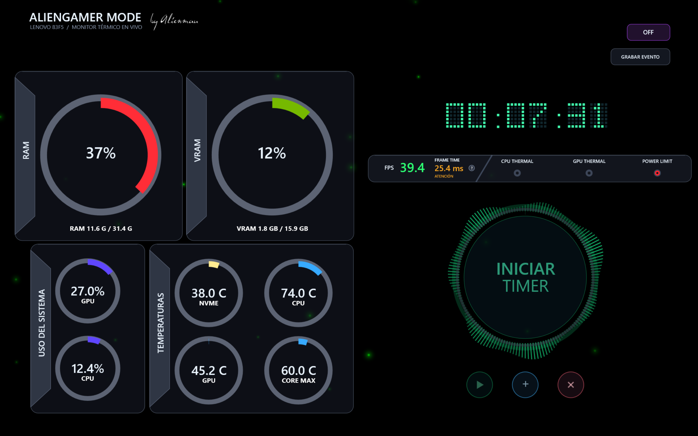
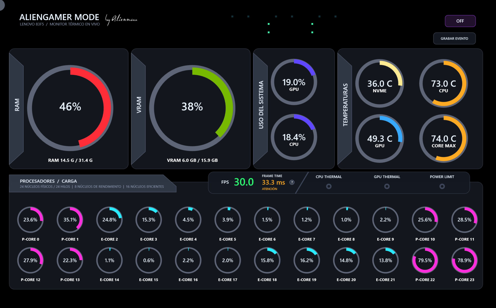
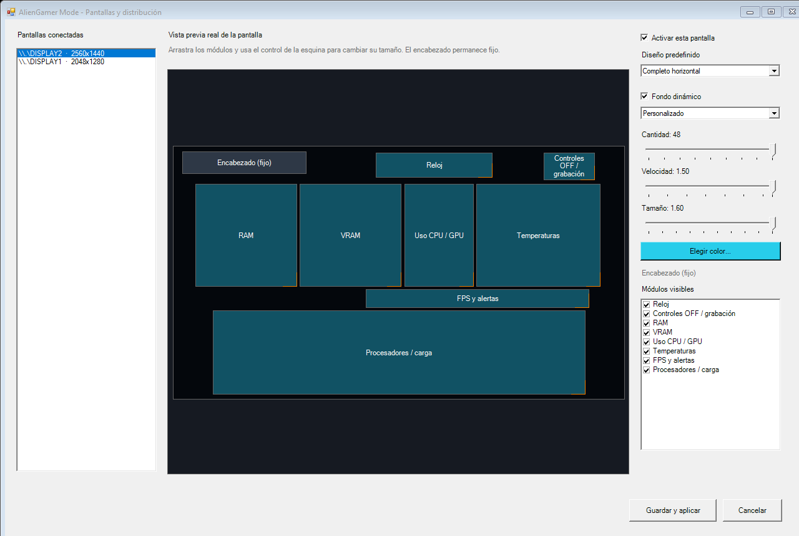
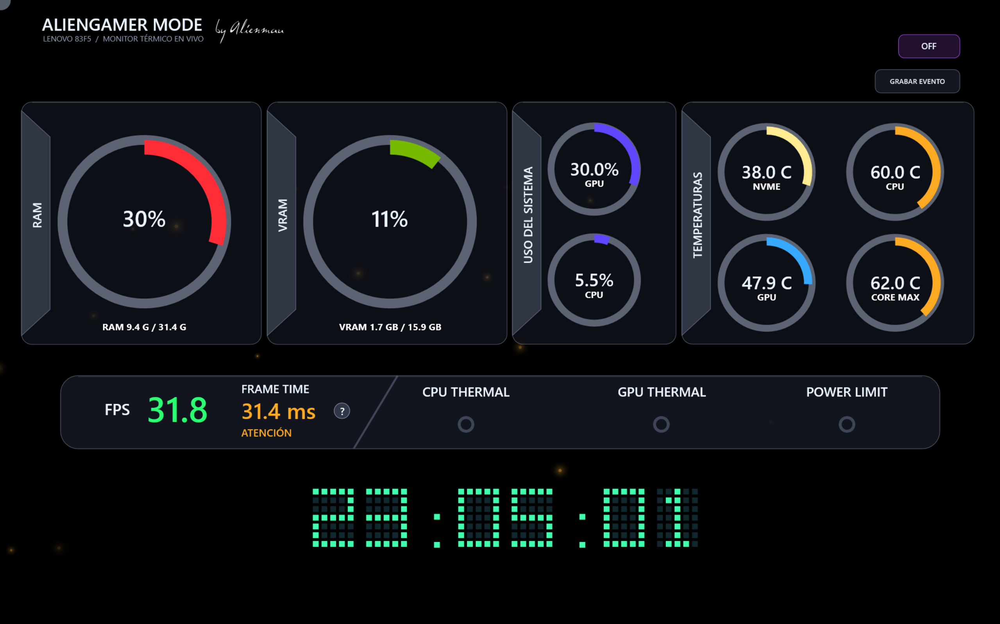
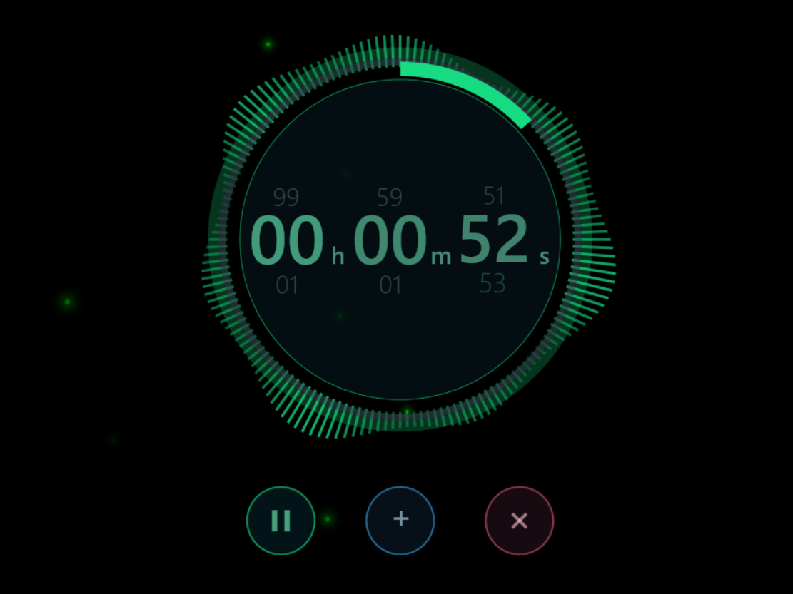
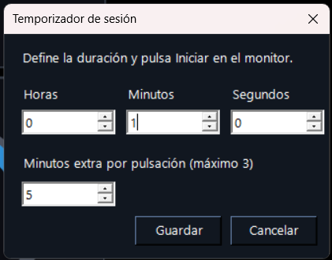
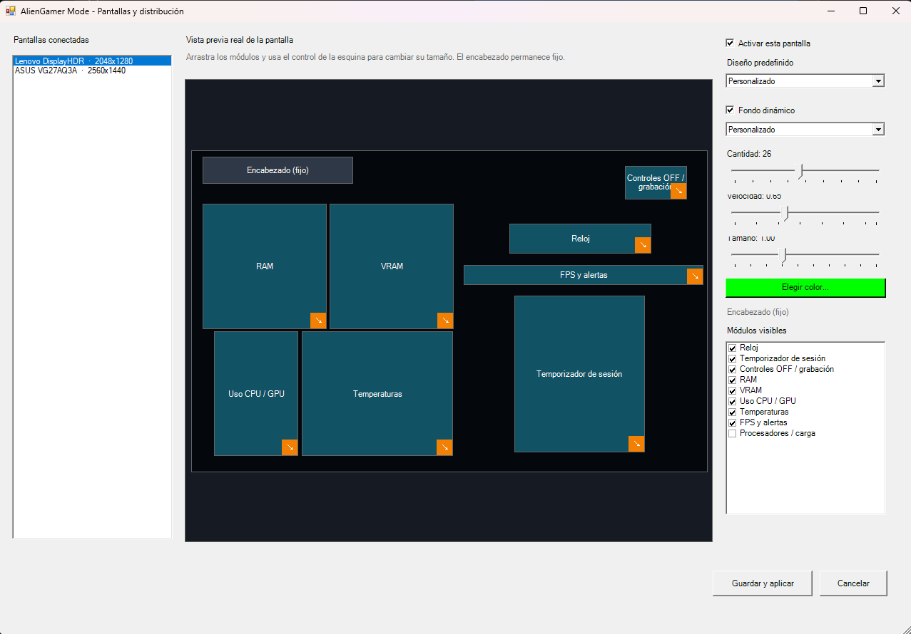
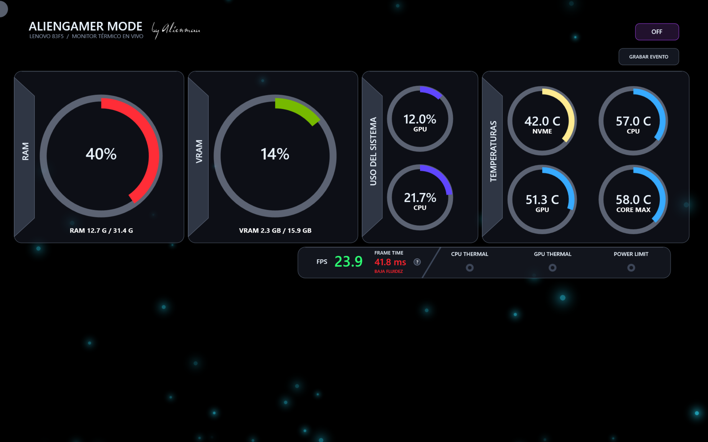

# AlienGamer Mode

**Español** · [English](README.en.md)

**Monitoreo adaptable de sensores y componentes del equipo para Windows.**

La versión **1.7.0** incorpora un [panel móvil local](docs/MOBILE-LAN.md) por QR y el nuevo [Enfoque de pantallas](docs/DESKTOP-STUDIO.md): tarjetas arriba, vista previa centrada y opciones en un panel lateral inferior, con tema oscuro y acento naranja. [Notas completas en español e inglés y capturas](docs/RELEASE-1.7.0.md). [Próximas mejoras](docs/ROADMAP.md), incluido el módulo de ventiladores pendiente de validar sensores.



[](https://github.com/alienmau/AlienGamer-Mode/releases/latest)
[](https://github.com/alienmau/AlienGamer-Mode/releases)
[](LICENSE)
[](#requisitos)

**[Descargar la última versión](https://github.com/alienmau/AlienGamer-Mode/releases/latest)** · **[Guía de instalación](docs/GUIA-INSTALACION-MANUAL.md)** · **[Reportar un problema](https://github.com/alienmau/AlienGamer-Mode/issues/new/choose)**

AlienGamer Mode es un panel gamer creado con Rainmeter y HWiNFO. Detecta el hardware disponible, adapta el diseño a la pantalla seleccionada y muestra métricas útiles sin inventar valores cuando un sensor no existe.

La versión 1.6.5 añade un temporizador de sesión opcional en cada pantalla. Se configura desde el propio módulo, conserva la duración y los incrementos extra, y ofrece un aro con ondas, cuenta regresiva y aviso **GAME OVER**. También corrige la selección de VRAM en equipos con GPU integrada y dedicada, elimina ventanas PowerShell auxiliares y refuerza el cierre coordinado con **OFF**. El editor multidisplay sigue permitiendo mover, ocultar y redimensionar módulos por pantalla.

## ¿Por qué AlienGamer Mode?

Un contador de FPS dice que algo ocurrió; AlienGamer Mode ayuda a conservar el contexto técnico del momento. Si notas un tirón, congelamiento, teletransporte o caída de fluidez, puedes iniciar una grabación y obtener un reporte que relacione el comportamiento del juego con temperaturas, carga, memoria, tiempo de cuadro y alertas disponibles.

- **Adaptable:** detecta el hardware real y reorganiza los módulos disponibles.
- **Honesto con los datos:** un sensor ausente se oculta o muestra `N/D`; nunca se inventa como cero.
- **Útil para investigar:** registra el intervalo exacto donde percibiste el problema.
- **Local y abierto:** no envía telemetría y su código puede auditarse.
- **Pensado para OLED:** realiza pequeños desplazamientos para reducir elementos estáticos prolongados.



## Funciones principales

- RAM, VRAM, carga de CPU y GPU.
- Temperaturas de CPU, núcleo máximo, GPU y almacenamiento principal.
- Carga dinámica por núcleo; los núcleos inexistentes se ocultan y los restantes se reorganizan.
- FPS y *frame time* con clasificación visual de fluidez.
- Indicadores de límite térmico y de potencia cuando HWiNFO los proporciona.
- Reloj digital tipo matriz.
- Temporizador de sesión opcional por pantalla con duración e incrementos extra configurables, aro animado y aviso visual al llegar a cero.
- Fondo ambiental opcional con partículas luminosas tipo luciérnaga.
- Glassmorfismo oscuro que permite percibir el fondo sin perder legibilidad.
- Animación suavizada de anillos y destello en rangos críticos.
- Protección para pantallas OLED mediante pequeños desplazamientos periódicos.
- Grabación manual de eventos y exportación de registros para diagnóstico.
- Agente de bandeja para activar, detener, grabar y cerrar el monitor.
- Visibilidad, posición y tamaño persistentes por pantalla para los módulos opcionales.
- Selección de monitor, GPU y unidad principal durante la instalación.
- Interfaz en español e inglés, seleccionable durante la instalación o desde el icono de bandeja sin reiniciar los sensores.
- Varias vistas simultáneas en monitores locales, con distribución independiente y persistente.
- Editor visual para arrastrar y redimensionar RAM, VRAM, uso, temperaturas, FPS, procesadores, reloj, temporizador y controles; el encabezado permanece fijo y siempre visible.

## Requisitos

- Windows 10 u 11 de 64 bits.
- 4 GB de RAM como mínimo para ejecutar el monitor; 8 GB recomendados y 16 GB recomendados si se jugará en el mismo equipo.
- Procesador x64 de dos núcleos como mínimo.
- 100 MB de espacio libre para AlienGamer Mode y sus dependencias, sin contar reportes guardados.
- [Rainmeter 4.5 o posterior](https://www.rainmeter.net/).
- [HWiNFO 7.34 o posterior](https://www.hwinfo.com/download/), con sensores y memoria compartida habilitados.
- Microsoft Excel es opcional; solo se necesita para abrir directamente los reportes `.xlsx`.

Rainmeter y HWiNFO son productos externos y no se distribuyen dentro de este repositorio.

### Consumo orientativo

Medición realizada durante 15 segundos en el equipo de desarrollo, con 24 procesadores lógicos, 48 luciérnagas, animación a 10 FPS y todos los sensores activos:

| Componente | RAM promedio | CPU promedio del equipo |
| --- | ---: | ---: |
| Agente de AlienGamer Mode | 122 MB | 0.16% |
| Puente de sensores | 221 MB | 0.43% |
| Rainmeter | 82 MB | 4.54% |
| HWiNFO | 31 MB | 0.28% |
| **Conjunto completo** | **aprox. 457 MB** | **aprox. 5.4%** |

Son valores orientativos, no requisitos garantizados. El consumo cambia según procesador, cantidad de sensores/núcleos, número y tamaño de partículas, otras skins cargadas en Rainmeter y versión de HWiNFO. Reducir las luciérnagas o desactivar el fondo disminuye la carga visual.

## Compatibilidad

El instalador permite elegir pantalla, GPU y almacenamiento principal. La skin se construye según la resolución, escala DPI y sensores detectados. El proyecto nació en un Lenovo Legion, pero no está limitado a esa marca.

La validación comunitaria en combinaciones NVIDIA, AMD e Intel continúa. Si lo pruebas en otro equipo, abre un **Reporte de compatibilidad** desde [Issues](https://github.com/alienmau/AlienGamer-Mode/issues/new/choose); incluso un resultado correcto ayuda a documentar hardware confirmado.

## Instalación

1. Instala y configura los requisitos indicados arriba.
2. Descarga el instalador más reciente desde [Releases](https://github.com/alienmau/AlienGamer-Mode/releases/latest).
3. Ejecuta `AlienGamerMode-Setup-1.7.0.exe` y elige **Español** o **English**.
4. Selecciona la pantalla, GPU y unidad de almacenamiento que deseas supervisar.
5. Finaliza la instalación; el panel se activa automáticamente y queda disponible desde el icono de la bandeja.

Consulta [Requisitos previos](docs/REQUISITOS-PREVIOS.md) y la [Guía de instalación manual](docs/GUIA-INSTALACION-MANUAL.md) si necesitas configurar HWiNFO o resolver un problema.

## Pantallas y distribución

Abre el menú del icono de bandeja y selecciona **Pantallas y distribución...**. El editor muestra cada monitor conectado y permite:

- activar una o varias pantallas al mismo tiempo;
- arrastrar y redimensionar cada bloque dentro de una previsualización con la proporción real de la pantalla;
- mostrar u ocultar cualquier módulo sin detener los sensores;
- aplicar diseños completos, esenciales, verticales, sólo rendimiento o sólo temperaturas;
- activar o desactivar el fondo por pantalla y elegir fondo personalizado o térmico;
- ajustar cantidad, velocidad, tamaño y color de las luciérnagas cuando el fondo personalizado está activo.

Los diseños predefinidos se reflejan de inmediato en la previsualización; el monitor real sólo cambia al pulsar **Guardar y aplicar**. Los bloques se mantienen dentro de la pantalla, respetan una separación mínima y no pueden solaparse. El encabezado es obligatorio y no puede arrastrarse: permanece en la esquina superior izquierda, excepto en **Esencial vertical**, donde se centra arriba para aprovechar mejor el ancho.

Pulsa **Guardar y aplicar** para reconstruir únicamente las vistas de Rainmeter. HWiNFO, el puente local y la grabación permanecen compartidos. La selección se conserva en `displayViews` dentro de `%LOCALAPPDATA%\AlienGamerMode\AlienGamerMode.json` y vuelve a aplicarse al iniciar Windows.

La primera vista mantiene la pantalla elegida en el instalador. El editor se abre automáticamente al terminar la instalación con el diseño completo y los módulos tradicionales visibles; el temporizador de sesión es opcional y empieza oculto. El usuario puede conservar el diseño o personalizarlo. Cada instalación reinicia los ajustes visuales y los temporizadores, respaldando el JSON y los estados anteriores; conserva grabaciones y reportes. La versión 1.7.0 añade un panel móvil de sólo lectura probado desde Chrome en un teléfono real.

### Varias pantallas y distribución visual

AlienGamer Mode puede activar una vista distinta en cada monitor conectado desde una sola instalación:

- **Pantallas independientes:** cada pantalla puede estar activada o desactivada sin detener las demás.
- **Módulos por pantalla:** reloj, temporizador, controles, RAM, VRAM, uso CPU/GPU, temperaturas, FPS/alertas y procesadores pueden mostrarse u ocultarse de forma independiente.
- **Posición y tamaño libres:** los módulos visibles se arrastran y redimensionan dentro de una previsualización que conserva la proporción y resolución real del monitor.
- **Protección del diseño:** el editor impide solapamientos, salidas del lienzo y separaciones inseguras. El encabezado permanece visible y fijo como identidad de la vista.
- **Diseños predefinidos:** completo horizontal, esencial horizontal, esencial vertical, sólo rendimiento y sólo temperaturas pueden previsualizarse antes de aplicarlos.
- **Fondos independientes:** cada pantalla puede usar fondo desactivado, personalizado o dinámico térmico. Los controles manuales sólo aparecen cuando corresponden.
- **Persistencia:** las selecciones quedan guardadas para los siguientes arranques.
- **Aplicación rápida:** los cambios visuales reutilizan el perfil de sensores validado, muestran `Aplicando cambios…` sobre las pantallas afectadas y evitan reiniciar HWiNFO o el puente de datos.

Para que el menú del icono sea más claro, las antiguas opciones globales **Fondo** y **Módulos visibles** se trasladaron a **Pantallas y distribución...**. Allí pueden configurarse correctamente por monitor. El menú principal conserva las acciones generales: activar o detener el monitor, grabar o marcar un incidente, seleccionar idioma, reconfigurar monitor/GPU/SSD, abrir el editor, consultar registros y cerrar la aplicación.





## Temporizador de sesión

Actívalo desde **Pantallas y distribución...**, arrástralo y ajusta su tamaño como cualquier otro módulo. El centro abre el formulario para definir horas, minutos, segundos y el incremento extra por pulsación. **Play** permanece deshabilitado hasta guardar una duración; después permite iniciar o pausar. El botón **+** añade hasta tres incrementos y **X** cancela la sesión.

El aro avanza suavemente y sus 160 barras luminosas se mueven alrededor del círculo. Usa verde hasta el 70 % del tiempo consumido, ámbar hasta el 85 % y rojo intenso al final, con transición de color de aproximadamente 0,3 segundos. Los dígitos que cambian ruedan y destellan. Al llegar a cero, **GAME OVER** queda fijo. Sin configuración muestra ceros; al volver a abrir el monitor recupera la duración elegida lista para iniciar, no una sesión terminada.







### Panel móvil local — 1.7.0

En **Pantallas y distribución → Pantalla móvil (celular / tablet)** marca **Activar monitor web en mi red local**: el servicio arranca y aparece el QR automáticamente. Elige los módulos y pulsa **Aplicar módulos** si cambias la selección. Escanea el QR desde un dispositivo conectado al mismo router y abre la página. La laptop puede estar conectada por Ethernet y el móvil por Wi-Fi. La vista adapta las tarjetas a vertical u horizontal; **Pantalla completa** y **Salir de pantalla completa** sólo afectan al navegador del móvil, nunca apagan Rainmeter, HWiNFO ni el monitor de la laptop.

El servicio está desactivado por defecto. Usa una IP privada y el puerto 27844, no utiliza la nube, sólo entrega datos de sensores y exige el enlace secreto del QR. **Nuevo QR** invalida el enlace anterior automáticamente; desactivar el acceso cierra el servicio. El instalador prepara una regla de firewall limitada al puerto de la app y a la subred local. Quien tenga el QR y esté en esa red podrá ver las métricas. El modo pantalla completa requiere tocar el botón y depende del navegador; algunos navegadores móviles mantienen su barra visible.

La vista móvil incorpora reloj matricial, anillos individuales para RAM/VRAM/CPU/GPU, temperaturas agrupadas y luciérnagas decorativas. **Editar** permite ordenar, ocultar y elegir **Mínimo** (1 columna), **Normal** (ancho base por módulo) o **Extendido** (fila completa). La distribución masonry aprovecha el alto natural de cada tarjeta sin huecos de fila ni alturas fijas, conserva los tamaños al girar y deja Extendido como separador de fila completa. FPS y tiempo de cuadro están unidos; ese bloque y alertas ocupan 2 columnas en tamaño normal. Las tarjetas son translúcidas, con efecto vidrio, y los títulos están centrados. Puedes elegir el color de las luciérnagas desde Editar. Las preferencias se guardan en el dispositivo. **Expandir** y **Salir** controlan la pantalla completa; el aviso propio de Chrome no se puede modificar desde la página.

**Editar → Mantener pantalla encendida** solicita el permiso nativo únicamente cuando el navegador lo admite en un contexto seguro. Con el enlace HTTP local actual queda deshabilitado y explica la limitación; no exige certificados manuales ni cambios de seguridad. Sólo indica «Activa» tras recibir el permiso real, respeta su rechazo/liberación y permite bloquear manualmente. La alternativa de vídeo fue retirada. HTTPS local aún no está implementado y esta capacidad no se garantiza en todos los dispositivos. Detalles en [Panel móvil local](docs/MOBILE-LAN.md).

El usuario confirmó acceso desde Chrome móvil por Wi-Fi y aportó capturas del nuevo diseño vertical, horizontal y de su editor. Las pruebas automáticas cubren servidor, QR, ocho resoluciones, edición persistente, arrastre y rotación. Quedan pendientes tablet/iOS reales y la confirmación final del arranque instalado sin consola; no se promete compatibilidad universal ni mantener pantalla encendida por HTTP.

## Fondo ambiental configurable

El fondo utiliza pequeñas partículas con degradado radial: el centro conserva el color elegido y el halo se desvanece hasta ser totalmente transparente. Las luciérnagas ascienden con trayectorias, tamaños, profundidades y velocidades diferentes; su brillo pulsa con transiciones suaves. El 70% puede recorrer hasta el 75% de la altura de la pantalla y se desvanece en ese trayecto, mientras el 30% completa el 100% y rebasa ligeramente el borde superior. No utiliza, captura ni analiza audio.

Desde **Pantallas y distribución...**, cada monitor puede usar **Desactivado**, **Personalizado** o **Dinámico térmico** de manera independiente. En modo personalizado se utiliza el color elegido por el usuario. En modo térmico, CPU, núcleo máximo y GPU se comparan con sus propios umbrales y prevalece el estado válido más exigente: azul para temperatura saludable, naranja para elevada y rojo para alta o con alerta térmica. El antiguo menú global **Fondo** fue retirado para impedir que un cambio sobrescriba accidentalmente todas las pantallas.

La densidad térmica combina 70% de fluidez/estabilidad reciente de *frame time* y 30% de actividad CPU/GPU. La velocidad responde a la mayor carga válida entre CPU y GPU. Si la GPU se acerca a saturación o el *frame time* se degrada, el fondo cede recursos reduciendo progresivamente partículas y movimiento. Los cambios utilizan interpolación para evitar saltos. Si FPS o un sensor térmico no están disponibles, el sistema ignora esa lectura y utiliza solamente datos válidos; no convierte `N/D` en cero real.

Los controles de luciérnagas están disponibles en el editor únicamente cuando esa pantalla usa **Personalizado** y permiten elegir entre 8 y 48 partículas, ajustar velocidad y tamaño, y seleccionar cualquier color. **Dinámico térmico** usa parámetros automáticos independientes y conservadores; sus controles manuales se deshabilitan para evitar configuraciones contradictorias. Todos los valores se conservan en `%LOCALAPPDATA%\AlienGamerMode\AlienGamerMode.json`.

Desde el icono de bandeja, **Configurar equipo y pantalla...** permite volver a elegir monitor, GPU y almacenamiento principal sin reinstalar. La pantalla se conserva mediante su identidad física, por lo que sigue siendo reconocible aunque Windows cambie su nombre interno de `DISPLAY1` a otro número.

La visibilidad de los módulos se administra desde **Pantallas y distribución...** para evitar ambigüedades cuando existen varias pantallas. Ocultar un módulo no elimina sus sensores: siguen disponibles para la grabación técnica de eventos.

## Idioma

El instalador 1.2.0 permite elegir español o inglés. Después de instalar, abre el menú del icono de bandeja y selecciona **Idioma → Español** o **Language → English**. La preferencia se guarda en `language` dentro de `%LOCALAPPDATA%\AlienGamerMode\AlienGamerMode.json`.

Si el monitor está activo, la skin se regenera y refresca sin detener HWiNFO ni el puente de sensores. Si está detenido, el idioma se aplicará en la siguiente activación. No es necesario reiniciar Windows.



## Grabar un evento de rendimiento

Si durante una partida notas tirones, congelamientos, teletransportes, caídas de fluidez o cualquier comportamiento extraño, pulsa **Grabar evento** en el panel o en el icono de la bandeja. El botón cambia a **Finalizar grabación** mientras la captura está activa.

Mientras el monitor está activo conserva localmente los últimos 60 segundos. Al iniciar la grabación incorpora ese contexto previo. Durante la captura selecciona **Marcar incidente ahora** en el icono de bandeja —o usa clic derecho sobre el botón de grabación— cada vez que notes el problema.

AlienGamer Mode toma muestras y conserva, cuando el equipo dispone de ellas, métricas como FPS, *frame time*, uso y temperatura de CPU y GPU, VRAM, RAM, temperatura del almacenamiento, carga por núcleo y señales de límite térmico o de potencia. Al finalizar, solicita una ubicación y guarda tres archivos complementarios: un reporte visual HTML, un libro de Excel y el CSV bruto. El reporte visual se abre en cualquier navegador, no requiere conexión y contiene:

- contexto previo, cronología y ventanas de 15 segundos antes y después de cada marca;
- datos brutos completos en el libro y en un CSV adicional;
- P95/P99, picos y puntuación de estabilidad de 0 a 100;
- comparación con la sesión anterior guardada localmente;
- procesos activos, contexto del equipo y alertas observadas;
- interpretación, evidencia y recomendación preliminares;
- asistente de privacidad para ocultar identificadores del equipo y PID.

El HTML presenta FPS y *frame time* en gráficas separadas con escalas correctas, además de temperaturas, utilización e incidentes. Excel es opcional: si no está disponible, el reporte visual y el CSV aún pueden generarse y conservar la evidencia.

El reporte permite relacionar el instante del problema con temperaturas elevadas, saturación de recursos, límites térmicos o de potencia y variaciones anormales del tiempo de cuadro. Puede aportar datos técnicos valiosos a un especialista y ayudar a detectar una condición antes de que se vuelva recurrente. Es una herramienta de orientación: no sustituye los registros internos del juego, diagnósticos SMART detallados, análisis de red ni trazas especializadas, y por sí sola no confirma una falla de hardware.

## Vista de rendimiento

En **Pantallas y distribución...**, selecciona el diseño **Sólo rendimiento** para centrar el bloque de FPS, *frame time* y alertas. Antes de guardar puedes moverlo, redimensionarlo o combinarlo con otros módulos. La selección se conserva al reiniciar y no detiene la captura de sensores.

## Estructura del proyecto

- `assets/`: logotipo, icono y firma convertida a imagen.
- `config/`: parámetros predeterminados editables sin modificar código.
- `docs/`: arquitectura, requisitos y guía de mantenimiento.
- `installer/`: asistente gráfico y proyecto de Inno Setup 6.
- `src/`: descubrimiento de hardware, puente de sensores, agente, grabador y skin.
- `tests/`: validaciones automatizadas y escenarios con sensores ausentes.

La [documentación de arquitectura](docs/ARQUITECTURA.md) explica el flujo completo para desarrolladores y asistentes de IA que den mantenimiento al proyecto.

## Compilar el instalador

Instala Inno Setup 6 y ejecuta:

```powershell
powershell.exe -NoProfile -ExecutionPolicy Bypass -File .\installer\Build-Installer.ps1
```

El instalador se genera dentro de `build/installer/`.

## Pruebas

```powershell
powershell.exe -NoProfile -ExecutionPolicy Bypass -File .\tests\Test-AlienGamerMode.ps1
```

Antes de publicar una versión se recomienda probarla en equipos NVIDIA, AMD e Intel; CPU híbrida y convencional; varias resoluciones y escalas DPI; y configuraciones con sensores opcionales ausentes.

## Privacidad y seguridad

El monitor trabaja localmente. Los registros solo se crean cuando el usuario inicia una grabación y se guardan en la ubicación elegida. El reporte puede incluir nombres de procesos y características del equipo; revísalo antes de compartirlo y no publiques información que consideres privada.

Los problemas de seguridad deben reportarse siguiendo [SECURITY.md](SECURITY.md), no como una incidencia pública.

## Contribuir

Las correcciones y propuestas son bienvenidas. Lee [CONTRIBUTING.md](CONTRIBUTING.md) antes de abrir una incidencia o enviar cambios.

Si deseas compartir el proyecto, encontrarás publicaciones listas para adaptar, enlaces de imágenes y una guía para evitar spam en [Difusión y lanzamiento](docs/DIFUSION.md).

## Licencia

El código propio se publica bajo la [licencia MIT](LICENSE). Los nombres, marcas y componentes de terceros conservan sus respectivas licencias. La fuente Dali no se incluye; la firma del autor se distribuye como una imagen rasterizada.

Creado por **Alienmau**.
